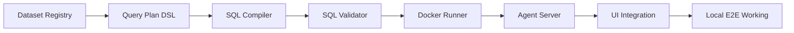
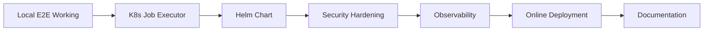

# CSV Analyst Chat - Strategic Implementation Plan

## Executive Summary

This document outlines a pragmatic, low-risk, incremental approach to building the CSV Analyst Chat PoC. The strategy prioritizes:

1. **Working end-to-end early** - Get a simple flow working in Docker Compose first
2. **Incremental complexity** - Add K8s/Helm only after local mode is solid
3. **Security built-in** - Sandboxing and validation from day 1, not bolted on
4. **Testability** - Tests written alongside features, not at the end
5. **Deploy-ability** - Keep deployment simple and well-documented

---

## Progress Update (2026-02-02)

Implemented:
- Dataset generation + registry (`datasets/registry.json`)
- QueryPlan DSL + deterministic SQL compiler
- Sandboxed runner (`runner/runner.py`, `runner/Dockerfile`)
- Runner hardening for CSV table/path handling
- Runner integration tests (`tests/integration/test_runner_container.py`)

Architecture note:
- QueryPlan DSL is handled upstream in agent-server; runner receives validated SQL + dataset file references only.

Runner usage today:
- `make build-runner-test` to build the test image
- `make test-runner` to run containerized runner integration tests

Not yet implemented:
- Agent-server executors and API orchestration
- UI integration and end-to-end chat flow
- Helm/Kubernetes runtime path

---

## Critical Path Analysis

### Minimum Viable Path (Days 1-3)

**Goal:** Working chatbot that can answer questions about CSV datasets using sandboxed SQL execution in Docker Compose.



**Critical dependencies:**
1. Dataset registry must exist before agent can list datasets
2. Query Plan DSL must be defined before agent can generate plans
3. SQL compiler must work before runner can execute queries
4. Docker runner must work before K8s runner (defer K8s until Phase 2)
5. Agent server must work before UI integration

### Extended Path (Days 4-5)

**Goal:** Production-ready deployment on Kubernetes with full observability.



---

## Implementation Strategy

### Phase 0: Bootstrap (4 hours)

**Objective:** Set up project structure and validate tech stack.

**Activities:**
1. Create directory structure
2. Set up Python environments (pyproject.toml or requirements.txt)
3. Validate LangChain Agent UI starter
4. Test DuckDB with sample CSVs
5. Test Docker SDK for Python
6. Create Makefile skeleton

**Success criteria:**
- [ ] Directory structure exists
- [ ] Can run `make dev` (even if it does nothing yet)
- [ ] Can import LangChain, DuckDB, Docker SDK
- [ ] LangChain UI runs locally (stock version)

**Risk mitigation:**
- If LangChain UI doesn't support dataset selection easily, plan for custom fork or adapter layer
- If Docker SDK has issues, consider subprocess fallback

---

### Phase 1A: Dataset & Query Foundation (8 hours)

**Objective:** Working dataset registry and query plan compiler.

**Activities:**
1. Generate 3 CSV datasets (ecommerce, support tickets, sensors)
2. Create dataset registry (JSON metadata)
3. Define QueryPlan Pydantic models
4. Implement QueryPlan → SQL compiler
5. Implement SQL validator (denylist-based)
6. Write unit tests for all of the above

**Success criteria:**
- [ ] 3 datasets exist with 12+ prompts total
- [ ] Can parse QueryPlan JSON and compile to SQL
- [ ] Can validate SQL (reject forbidden keywords)
- [ ] Tests pass (>80% coverage)

**Risk mitigation:**
- Keep datasets small (<50k rows) to avoid performance issues
- Keep QueryPlan DSL simple (don't over-engineer)
- Start with denylist SQL validation; defer AST parsing

**Testing strategy:**
- Unit test each dataset loader
- Unit test QueryPlan validation (good/bad plans)
- Unit test SQL compilation (determinism)
- Unit test SQL validator (red team fixtures)

---

### Phase 1B: Runner (SQL Mode) (6 hours)

**Objective:** Working Docker-based SQL runner with full sandboxing.

**Activities:**
1. Create runner Dockerfile (Python + DuckDB, non-root user)
2. Implement runner.py (read JSON stdin, execute SQL, return JSON stdout)
3. Test runner manually with docker run
4. Implement DockerExecutor in agent server
5. Write integration tests for runner

**Success criteria:**
- [x] Can build runner image
- [x] Can execute SQL queries in runner and get results back
- [x] Runner respects timeout, memory, CPU limits
- [x] Runner has no network access
- [ ] DockerExecutor can submit runs and retrieve results

**Risk mitigation:**
- Use tmpfs for DuckDB working directory (read-only root filesystem)
- Test timeout enforcement early
- Test container cleanup (don't leak containers)

**Testing strategy:**
- [x] Integration test: submit SQL → get result
- [x] Integration test: timeout enforcement
- [x] Integration test: invalid input/path handling → error handling
- [x] Security test: verify path/table-name hardening
- [ ] Security test: explicit runtime network egress check from inside runner

---

### Phase 1C: Agent Server Core (10 hours)

**Objective:** Working LangChain agent that can answer questions using tools.

**Activities:**
1. Set up FastAPI app
2. Implement dataset endpoints (GET /datasets, GET /datasets/{id}/schema)
3. Implement LangChain agent graph
   - System prompt (default to JSON plan, SQL optional)
   - Tools: list_datasets, get_dataset_schema, execute_query_plan, execute_sql, get_run_status
   - Structured output for QueryPlan
4. Implement /chat endpoint (call agent, validate, submit to executor, return result)
5. Implement run capsule storage (SQLite)
6. Implement /runs endpoints (POST, GET)
7. Add structured logging
8. Write integration tests

**Success criteria:**
- [ ] Can start agent server
- [ ] Can call GET /datasets and get metadata
- [ ] Can call POST /chat and get a response
- [ ] Agent generates valid QueryPlan JSON
- [ ] Agent submits plan to runner and returns result
- [ ] Run capsules are stored and retrievable

**Risk mitigation:**
- Use LangChain's structured output to force JSON schema compliance
- If agent doesn't follow instructions, tune system prompt or add validation retry loop
- Keep agent graph simple (no complex state machine)

**Testing strategy:**
- Integration test: ask question → agent generates plan → runner executes → result returned
- Integration test: ask for SQL explicitly → agent generates SQL → result returned
- Integration test: invalid plan → validation error → retry
- Unit test: run capsule CRUD

---

### Phase 1D: UI Integration (6 hours)

**Objective:** Working chat UI with dataset selection and result display.

**Activities:**
1. Configure LangChain Agent UI to talk to agent server
2. Add dataset selection dropdown (fetch from GET /datasets)
3. Add suggested prompts per dataset
4. Add chat message input
5. Display assistant responses (streaming if supported)
6. Add "Show details" panel (plan JSON, SQL, stats, logs, result table)
7. Add run status indicators
8. Test end-to-end flow

**Success criteria:**
- [ ] UI loads and shows dataset selector
- [ ] Can select dataset and see suggested prompts
- [ ] Can send message and get response
- [ ] Can see result table
- [ ] Can see "details" panel with plan/SQL/logs
- [ ] Run status shows correctly (Pending, Running, Succeeded, Failed)

**Risk mitigation:**
- If stock UI doesn't support dataset selection, create minimal custom build
- If streaming doesn't work easily, fall back to non-streaming
- Keep UI customizations minimal (prioritize function over polish)

**Testing strategy:**
- Manual E2E test: select dataset → click prompt → get result
- Manual test: 12+ curated prompts (4 per dataset)
- Screenshot/video for documentation

---

### Phase 1 Checkpoint: Local E2E Working (Day 2 end)

**Deliverable:** `docker compose up` → working chatbot

**Acceptance test:**
- [ ] Run `make dev` (starts compose)
- [ ] Open http://localhost:3000
- [ ] Select "Ecommerce" dataset
- [ ] Ask: "What's the average discount by category?"
- [ ] Get correct result table within 3 seconds
- [ ] See valid QueryPlan JSON in details panel
- [ ] See compiled SQL in details panel
- [ ] Verify run capsule stored in DB

**Go/No-go decision:** If local E2E doesn't work, **do not proceed to Phase 2**. Fix issues first.

---

### Phase 2A: Kubernetes Job Executor (8 hours)

**Objective:** Working K8s Job runner mode.

**Activities:**
1. Implement K8sJobExecutor (Kubernetes Python client)
2. Create Job spec with security context
3. Submit Job to namespace
4. Poll Job status (Pending, Running, Succeeded, Failed)
5. Fetch Pod logs for RunnerResponse JSON
6. Cleanup completed Jobs
7. Test with kind/k3d cluster
8. Write integration tests

**Success criteria:**
- [ ] Can submit K8s Job and get result
- [ ] Job has correct security context (runAsNonRoot, readOnlyRootFilesystem, etc.)
- [ ] Job respects timeout and resource limits
- [ ] Completed Jobs are cleaned up

**Risk mitigation:**
- Test Job submission early (don't wait until end of phase)
- Test Job cleanup (don't leak Jobs)
- Test RBAC permissions (create minimal Role/RoleBinding first)

**Testing strategy:**
- Integration test: submit run → Job created → result returned
- Integration test: timeout enforcement in K8s Job
- Integration test: concurrent Jobs

---

### Phase 2B: Helm Chart (6 hours)

**Objective:** Working Helm chart for K8s deployment.

**Activities:**
1. Create Helm chart structure
2. Create templates (deployments, services, ingress, RBAC, NetworkPolicy)
3. Create values.yaml (configurable images, ingress, runner config)
4. Lint chart (`helm lint`)
5. Test install on kind cluster
6. Write smoke test for K8s mode (`make k8s-smoke`)

**Success criteria:**
- [ ] `helm install` succeeds
- [ ] UI and agent server pods running
- [ ] Can access UI via ingress (or port-forward)
- [ ] Can run query and Job is created
- [ ] Smoke test passes

**Risk mitigation:**
- Start with minimal chart (no ingress at first if it's complex)
- Test RBAC early (most common deployment failure)
- Use NetworkPolicy deny-all-egress for runner pods (verify in tests)

**Testing strategy:**
- Integration test: `helm install` → pods ready → query works
- Security test: verify runner pod NetworkPolicy (try to curl from runner, should fail)

---

### Phase 2C: Security & Reliability Hardening (6 hours)

**Objective:** Production-grade security and error handling.

**Activities:**
1. Verify all security controls (runner security context, NetworkPolicy, output limits)
2. Implement data exfil heuristic (reject queries with missing limit + many columns + no aggregation)
3. Add system prompt safeguards against prompt injection
4. Write security test fixtures (prompt injection, SQL injection, data exfil, resource exhaustion)
5. Implement graceful error handling for all failure modes
6. Add retry logic for transient K8s failures
7. Write integration tests for failure paths

**Success criteria:**
- [ ] All security tests pass
- [ ] Red team fixtures fail safely (no data exfil, no prompt bypass)
- [ ] Error messages are user-friendly
- [ ] Failure modes don't crash the system

**Risk mitigation:**
- Test security controls early (don't wait until end)
- Document security assumptions in README

**Testing strategy:**
- Security test: prompt injection attempts
- Security test: SQL injection attempts
- Security test: data exfil attempts (SELECT * FROM huge_table)
- Integration test: timeout → user-friendly error
- Integration test: invalid plan → validation error → retry

---

### Phase 2D: Observability & Testing (6 hours)

**Objective:** Full test coverage and structured logging.

**Activities:**
1. Implement structured JSON logging across all services
2. Add request ID, run ID, dataset ID to all logs
3. Add /healthz and /readyz endpoints
4. Organize test suite (unit, integration, security)
5. Set up GitHub Actions CI (run tests, lint, build images)
6. Achieve >80% test coverage

**Success criteria:**
- [ ] Structured logs work (JSON format)
- [ ] Health endpoints work
- [ ] All tests pass in CI
- [ ] Test coverage >80%

**Testing strategy:**
- Run full test suite in CI on every PR
- Run smoke tests as part of CI
- Run security tests as part of CI

---

### Phase 2 Checkpoint: K8s Deployment Working (Day 4 end)

**Deliverable:** Helm chart works on kind/k3d cluster

**Acceptance test:**
- [ ] Run `make k8s-up` (creates kind cluster)
- [ ] Run `make helm-install` (installs chart)
- [ ] Port-forward to UI
- [ ] Run 3 queries (one per dataset)
- [ ] Verify Jobs created and results returned
- [ ] Run `make k8s-smoke` (smoke test passes)

**Go/No-go decision:** If K8s deployment doesn't work, **defer online deployment**. Document workaround or fix before Day 5.

---

### Phase 3A: Documentation (4 hours)

**Objective:** Complete README and hosting runbook.

**Activities:**
1. Write comprehensive README (see TODO.md P3.1)
2. Create hosting runbook (docs/hosting.md)
3. Document security model
4. Document troubleshooting steps
5. Add architecture diagram (optional but recommended)

**Success criteria:**
- [ ] README has all sections (quickstart local, quickstart K8s, deploy online, security, troubleshooting)
- [ ] Hosting runbook is step-by-step executable
- [ ] Security model is clearly documented

---

### Phase 3B: Online Deployment (6 hours)

**Objective:** Public URL live and tested.

**Activities:**
1. Choose hosting path (k3s on VM or managed K8s)
2. Provision cluster/VM
3. Build and push images to registry (GHCR)
4. Configure Helm values (image tags, ingress host, TLS)
5. Install chart
6. Verify with smoke test
7. Test public URL end-to-end
8. Document public URL in README

**Success criteria:**
- [ ] Public URL loads UI
- [ ] Can run queries and get results
- [ ] Jobs are created in K8s cluster
- [ ] TLS works (or HTTP with note)
- [ ] Smoke test passes against public URL

**Recommended path:** k3s on single VM (DigitalOcean, Linode, Hetzner)
- Fastest to public URL
- Cheapest ($5-10/month)
- Still demonstrates K8s + Helm + Jobs
- Single moving part (easier to debug)

**Alternative path:** Managed K8s (GKE, EKS, AKS, DOKS)
- Better evaluator optics ("real K8s")
- More expensive ($30-50/month minimum)
- More complexity (IAM, networking, etc.)

**Decision criteria:**
- If time is tight → k3s on VM
- If budget is not a concern → managed K8s
- If already have cloud credentials → managed K8s
- If want simplicity → k3s on VM

---

### Phase 3C: CI/CD & Polish (4 hours)

**Objective:** Automated builds and UX polish.

**Activities:**
1. Set up GitHub Actions workflow (build images, run tests, push to GHCR)
2. Add Makefile target: `make release TAG=v1.0`
3. Improve error messages in UI
4. Add loading states and spinners
5. Add ability to download run capsule JSON
6. Test all 12+ curated prompts

**Success criteria:**
- [ ] CI builds and pushes images on main branch
- [ ] All 12+ prompts work correctly
- [ ] UI has good UX (loading states, error messages, etc.)

---

### Phase 3 Checkpoint: MVP Complete (Day 5 end)

**Deliverable:** Public URL + README + passing tests

**Acceptance test:**
- [ ] Public URL works
- [ ] All MVP acceptance criteria pass (see TODO.md P3.5)
- [ ] README is complete
- [ ] CI/CD pipeline works
- [ ] Can demo to stakeholders

**Final checklist:**
- [ ] 12+ curated prompts all succeed
- [ ] Execution only happens in sandbox runner
- [ ] Runner has no network, read-only data, resource limits
- [ ] K8s mode works via Helm install and creates Jobs per run
- [ ] Capsules stored and retrievable
- [ ] Security tests pass
- [ ] Load test passes (5 concurrent users, 10 concurrent runs)

---

## Risk Management Matrix

| Risk | Impact | Probability | When to Address | Mitigation |
|------|--------|-------------|-----------------|------------|
| LangChain UI doesn't support dataset selection | High | Medium | Phase 0 | Validate early; plan for custom fork |
| SQL validation bypass | High | Low | Phase 1A | Use denylist + runner hardening |
| K8s RBAC too broad | Medium | Low | Phase 2A | Namespace-scoped Role |
| Model generates wrong plan | Medium | Medium | Phase 1C | Structured output + validation retry |
| K8s Job latency too high | Medium | Low | Phase 2A | Optimize later; acceptable for PoC |
| Hosting costs too high | Low | Medium | Phase 3B | Choose k3s on VM |
| Dataset changes require rebuilds | Low | High | Accept | Document evolution path |
| Timeout enforcement broken | High | Low | Phase 1B | Test early and often |

---

## Decision Framework

### When to defer a feature:
- Feature is a stretch goal
- Feature is not required for MVP acceptance
- Feature adds significant complexity
- Feature can be added later without major refactoring

### When to stop and fix:
- Local E2E doesn't work (Phase 1 checkpoint)
- Security tests fail
- Runner doesn't respect resource limits
- Agent doesn't generate valid plans

### When to simplify:
- Implementation is taking >2x estimated time
- Complexity is increasing risk
- Simpler alternative exists that meets requirements

---

## Daily Standup Template

**Day N - Date**

**Yesterday:**
- [x] Completed task 1
- [x] Completed task 2

**Today:**
- [ ] Task 1 (priority)
- [ ] Task 2

**Blockers:**
- None / [describe blocker]

**Risks:**
- [New risk identified] - mitigation: [plan]

**Questions:**
- [Question for stakeholder/reviewer]

---

## Success Metrics

### MVP Success (must achieve):
- [ ] Local dev works (`docker compose up`)
- [ ] K8s deploy works (`helm install`)
- [ ] Online deploy works (public URL)
- [ ] 12+ prompts succeed
- [ ] Security tests pass
- [ ] Load test passes (5 users, 10 runs)
- [ ] README complete

### Stretch Success (nice to have):
- [ ] Python execution mode works
- [ ] Charts render in UI
- [ ] Query caching works
- [ ] Multi-turn analysis works

---

## Post-MVP Roadmap

### v1.1 (Stretch goals):
- Restricted Python execution
- Simple chart output
- Query caching
- Multi-turn analysis sessions

### v1.2 (Operationalization):
- Prometheus metrics
- Grafana dashboards
- Alerting rules
- Backup/restore for capsules

### v2.0 (Feature expansion):
- Upload custom CSVs
- Join across datasets
- Export to CSV/JSON
- Scheduled queries
- Basic auth + per-user history

---

## Appendix: Tech Stack Summary

| Component | Technology | Why |
|-----------|-----------|-----|
| Agent Framework | LangChain | Industry standard, tool support, streaming |
| LLM | Claude 3.5 Sonnet (via API) | Best reasoning, structured output |
| UI | LangChain Agent UI (stock) | Speed, simplicity, no custom frontend |
| API Server | FastAPI | Fast, modern, async, good for LangChain |
| SQL Engine | DuckDB | Embedded, fast, good CSV support |
| Sandbox (local) | Docker SDK for Python | Easy container management |
| Sandbox (K8s) | Kubernetes Jobs | Native, secure, scalable |
| Deployment | Docker Compose (local), Helm (K8s) | Standard tools |
| Storage | SQLite (capsules) | Simple, no external DB needed for PoC |
| Logging | Python logging (JSON) | Structured, easy to search |
| Testing | pytest | Standard Python testing |
| CI/CD | GitHub Actions | Free, integrated, easy |
| Registry | GHCR | Free, integrated with GitHub |

---

## Appendix: File Structure (Reference)

```
adoptaisandbox/
├── README.md
├── TODO.md
├── CHANGELOG.md
├── Makefile
├── docker-compose.yml
├── .gitignore
├── docs/
│   ├── PRD/
│   │   ├── Core PRD.md
│   │   └── Deployment PRD.md
│   ├── IMPLEMENTATION_PLAN.md (this file)
│   ├── hosting.md (runbook)
│   └── architecture.png (optional diagram)
├── datasets/
│   ├── registry.json
│   ├── ecommerce/
│   │   ├── orders.csv
│   │   ├── order_items.csv
│   │   └── inventory.csv
│   ├── support_tickets/
│   │   └── tickets.csv
│   └── sensors/
│       └── sensors.csv
├── agent-server/
│   ├── Dockerfile
│   ├── pyproject.toml (or requirements.txt)
│   ├── main.py (FastAPI app)
│   ├── agent.py (LangChain agent graph)
│   ├── models.py (Pydantic models: QueryPlan, RunnerRequest, etc.)
│   ├── compiler.py (QueryPlan → SQL)
│   ├── validator.py (SQL policy validator)
│   ├── datasets.py (dataset registry loader)
│   ├── capsules.py (run capsule storage)
│   ├── executors/
│   │   ├── base.py (Executor interface)
│   │   ├── docker_executor.py
│   │   └── k8s_executor.py
│   └── tests/
│       ├── unit/
│       └── integration/
├── runner/
│   ├── Dockerfile
│   ├── runner.py
│   └── requirements.txt
├── ui/
│   ├── (LangChain Agent UI files)
│   └── Dockerfile
├── helm/
│   └── csv-analyst-chat/
│       ├── Chart.yaml
│       ├── values.yaml
│       └── templates/
│           ├── deployment-ui.yaml
│           ├── deployment-agent-server.yaml
│           ├── service-ui.yaml
│           ├── service-agent-server.yaml
│           ├── ingress.yaml
│           ├── serviceaccount.yaml
│           ├── role.yaml
│           ├── rolebinding.yaml
│           └── networkpolicy.yaml
├── tests/
│   ├── unit/
│   ├── integration/
│   └── security/
└── .github/
    └── workflows/
        └── ci.yml
```
